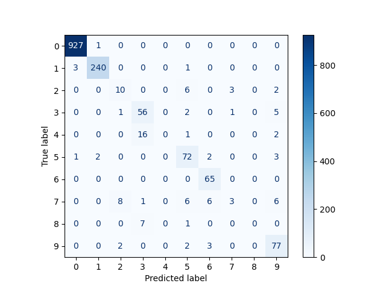

# Exercice NLP

Ce dépôt propose un exercice ouvert de traitement du langage naturel (NLP), à partir d'un problème fictif sur les publications de la HAS.

## Problématique métier (FICTIVE !)

Les publications de la HAS sont catégorisées selon divers thématiques, pour permettre la navigation sur le site internet.

Cette catégorisation prend beaucoup de temps aux documentalistes, qui aimeraient automatiser cette tache, en particulier pour les catégorie de la thématique `Maladies et états de santé` qui sont les plus difficiles.

🚀 L'équipe data a proposé d'étudier une fonctionnalité d'assistance à la catégorisation, qui serait intégrée à l'interface d'administration du site.

## Exercice

L'exercice consiste à travailler sur cette fonctionnalité d'assistance fictive.

Différentes étapes pourront être développées :
- Décrire la démarche de travail
- Acquisition et nettoyage des données
- Définition de métrique de succès
- Entraînement de modèles 
- Restitution des résultats
- Description du fonctionnement et de l'architecture de la solution envisagée en production

## En pratique

Une documentation sur les données et catégories est disponible dans le dossier `documentation`.

L'exercice sera développé sur un clone personnel de ce dépôt.

- Les documents descriptifs seront rédigé au format Markdown.
- Le principal langage à utiliser est Python pour le traitement de données. Les codes seront versionnés dans le dépôt (librairie `.py` et/ou notebook `.ipynb`).
- Les résultats pourront être présentés dans des notebooks, ou autre format de restitution au choix.
- La gestion des données utilisées et modèles est laissée libre.

## Disclaimer

Ce problème est potentiellement difficile et chronophage. 

Nous **n'attendons pas** de solution complète ou très performante.

Il sera bienvenu de simplifier le problème, pour s'attacher à un sous-problème plus simple.

Nous nous intéresserons à la démarche générale, aux compétences techniques et scientifiques sur le traitements de données et l'usage de librairies de NLP.


# Louis Dage
## Approche 
Un premier exercise de découverte du problème a été effectué dans le notebook `premier_test.ipynb` et la solution proposée pour répondre au problème est dans le script `script_deep_learning.py`. La solution proposée repose sur le finetuning d'une couche de Linéaire mise après un modèle de type transformer, au préalablement pré-entrainé sur un corpuse de données français.
Les résultats sont les suivants : 
- **Epoch 1** : Validation loss: 0.2119, **Validation accuracy: 0.9391**, **Validation F1-Score: 0.9394**

.

- **Epoch 2** : Validation loss: 0.1432, **Validation accuracy: 0.9631**, **Validation F1-Score: 0.9633**

.

On obtient de bon résultats dans l'ensemble même si on observe quelques limitations : 
- Il manque des classes dans le set de validation sur lesquelles on a pas le score  
- La classe numéro 9 ( RecommandationsProfessionnelles ) est celle sur laquelle le modèle s'en sort le moins bien, il faudrait investiguer cela.

Le détail de la solution se trouve ci-dessous : 

### Architecture du modèle

#### TransformerWithClassificationHead

Cette classe définit un modèle qui combine un transformer pré-entraîné avec une tête de classification personnalisée. Les composants clés incluent :

- **Modèle Pré-entraîné** : Un modèle transformer (`AutoModel`) qui extrait les caractéristiques du texte d'entrée.
- **Tête de Classification** : Une couche linéaire qui mappe les sorties du transformer au nombre souhaité de classes en sortie.

##### Méthodes

- `mean_pooling` : Réalise un pooling sur les embeddings des tokens, pondéré par le masque d'attention.
- `forward` : Définit la passe avant à travers le transformer et la tête de classification.
- `predict` : Génère des prédictions pour les données d'entrée en utilisant le modèle entraîné.

### Préparation des données

#### TextDataset

La classe `TextDataset` est responsable de la gestion des données d'entrée et de la tokenisation des textes. Elle retourne des données tokenisées, y compris les IDs des entrées, les masques d'attention, les IDs de type de tokens, et les labels.

#### Une "Collate_funcction" Personnalisée

Une fonction de collation personnalisée (`custom_embedding_collate_fn`) est utilisée pour remplir dynamiquement les séquences d'entrée à la longueur maximale de chaque batch. Cela garantit que les batches sont correctement formatés pour le modèle transformer.

### Entraînement et Évaluation

#### Entraînement

Le modèle est entraîné en utilisant la fonction `train_epoch`, qui :

- Boucle à travers le DataLoader d'entraînement.
- Effectue une passe et calcule la loss.
- Met à jour les paramètres du modèle en utilisant la backpropagation.

#### Évaluation

La fonction `eval_epoch` évalue les performances du modèle sur l'ensemble de validation. Elle calcule :

- **Perte de Validation** : La perte moyenne sur l'ensemble de validation.
- **Précision** : La proportion de prédictions correctes.
- **F1-Score** : Une moyenne harmonique de la précision et du rappel.

La fonction suit également les métriques de performance et les affiche dans une barre de progression.

### Résultats et Visualisation

Après chaque époque, les performances du modèle sont imprimées, y compris la perte d'entraînement, la perte de validation, la précision et le F1-score. De plus, une matrice de confusion est générée pour visualiser les performances du modèle sur différentes classes.

### Comment exécuter le code

0. **Création de l'environnement conda.**
   ```bash
   conda create --name mon_env python=3.9
    ```
1. Assurez-vous que toutes les dépendances sont installées.
   ```bash
   pip install -r requirements.txt
    ```
3. Entraînez le modèle en exécutant le script principal.
   ```bash
   python script_deep_learning.py
    ```

### Conclusion

Cette approche exploite la puissance des modèles transformers pour les tâches de classification de texte. En ajustant un transformer pré-entraîné, le modèle peut apprendre efficacement à classifier les entrées textuelles en fonction de leur contenu, atteignant une précision et un F1-score raisonnables sur l'ensemble de validation.